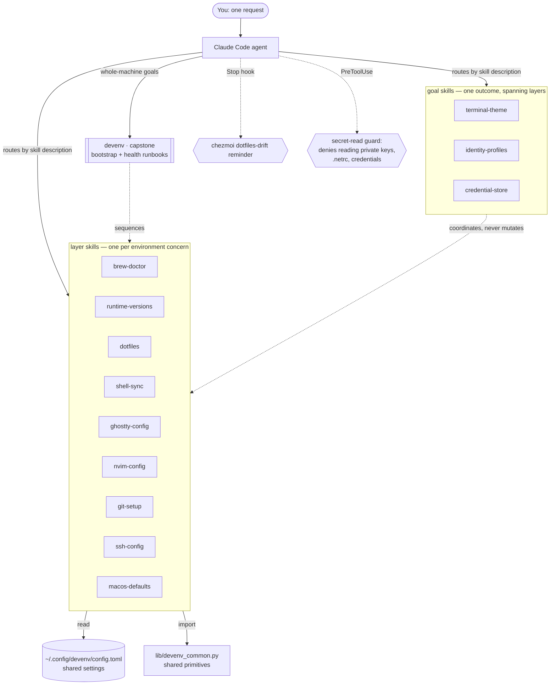
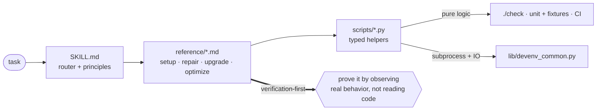

# claude-skills — a Claude Code plugin marketplace

[](https://github.com/johnplantada/claude-skills/actions/workflows/test.yml)
[](LICENSE)

A [Claude Code](https://claude.com/claude-code) marketplace containing two independently installable
plugins: **devenv**, a gallery that sets up, repairs, upgrades, and optimizes a development
environment; and **digital-twin**, a privacy-first builder for an evidence-backed professional
context bundle.

Both plugins are review-first: deterministic checks validate structure and behavior, while the human
owner remains authoritative over changes, sensitive material, and publication.

## Plugins

| Plugin | What it does |
|---|---|
| **devenv** | Thirteen verification-first skills for Homebrew, runtimes, dotfiles, shells, Ghostty, Neovim, git, ssh, macOS, identities, credentials, and whole-machine coordination. |
| [**digital-twin**](plugins/digital-twin/) | Builds a consenting owner's private professional context by reviewing selected documents first, then using a gap-driven interview, with atomic claims, owner approval, privacy boundaries, and deletion propagation. |

## devenv architecture

Three tiers. A capstone holds the whole-machine coordination knowledge; **goal skills** each own one
outcome that no single layer can deliver alone; layer skills each own exactly one concern and are the
only things that mutate it. A shared library and settings store keep them consistent.
*One brain, many hands.*



**What makes a goal skill** (rather than another layer): it names a user-visible outcome, no single
layer can deliver it, it has a *source-of-truth model* the other surfaces derive from, it can detect
the specific drift that breaks that model, and it declares its boundaries with the layers it spans.
`terminal-theme` inherits from the Ghostty theme; `identity-profiles` derives from the directory
tree; `credential-store` resolves from one store. Anything missing the model or the detector is a
runbook, and belongs in `devenv`.

## devenv skills

| Skill | What it does |
|---|---|
| [**brew-doctor**](skills/brew-doctor/) | Find, set up, repair, upgrade, and optimize Homebrew safely — search + choose the best install, a reproducible Brewfile, gated upgrades, and taming of silent auto-upgrades so a background `brew upgrade` never breaks your tools. |
| [**runtime-versions**](skills/runtime-versions/) | Manage language runtimes with one tool — mise — instead of nvm/asdf/pyenv fighting over PATH; migrate off the sprawl and fix per-shell `node`-differs bugs. |
| [**dotfiles**](skills/dotfiles/) | Version-control your configs with chezmoi, sync across machines, bootstrap a new machine, and keep secrets out of git (their plaintext never enters the model's context). |
| [**shell-sync**](skills/shell-sync/) | Keep zsh ↔ fish consistent (mirror one canonical shell's env/PATH/aliases/prompt into the other) and keep PATH healthy — verified by resolving both shells and comparing. |
| [**ghostty-config**](skills/ghostty-config/) | Manage your Ghostty config as a version-controlled file — the macOS-robust way (real config in `~/.config`, pulled in via a `config-file` include so it isn't silently overridden), proven with `ghostty +validate-config`. |
| [**terminal-theme**](skills/terminal-theme/) | Coordinate one theme across Ghostty, fish, zsh, and starship so they never clash — the "inherit" model makes them follow Ghostty's ANSI palette, so one edit re-themes the whole terminal. |
| [**nvim-config**](skills/nvim-config/) | Set up, repair, upgrade, and optimize a Neovim config — lazy.nvim-first, every change verified by driving headless Neovim. |
| [**git-setup**](skills/git-setup/) | Configure global git — signing, pager, defaults, and work-vs-personal identities — verified so commits actually verify and identities resolve. |
| [**identity-profiles**](skills/identity-profiles/) | Coordinate *who you are* per directory tree across git, ssh, signing, and gh — catching the two silent failures no single layer can see: right email + wrong key, and signed-but-Unverified for the second identity. |
| [**credential-store**](skills/credential-store/) | Get credentials off disk and into one store, so configs *reference* a secret instead of embedding it — classifying every assignment literal vs. reference, with the value structurally unable to reach the model. |
| [**ssh-config**](skills/ssh-config/) | Clean up `~/.ssh/config` + key hygiene and generate/rotate ed25519 keys — treating private keys as secrets that never leave the machine or enter the model's context. |
| [**macos-defaults**](skills/macos-defaults/) | Capture a Mac's preferences into idempotent `defaults` code, apply on any machine, and audit for drift — each setting proven by re-reading it. |
| [**devenv**](skills/devenv/) 🧭 | **Capstone.** The shared settings store the others read, plus ordered cross-skill runbooks — bootstrap a machine end-to-end and run a whole-environment health sweep. Delegates down; never duplicates a layer's logic. |

## Anatomy of a skill

Each skill is small always-on routing that hands off to detailed workflows and tested Python helpers.



## Design principles

- **Verification-first** — prove a change by observing real behavior, not by reading code.
- **Progressive disclosure** — a small always-on `SKILL.md` routes to `reference/` workflows loaded
  only when needed, so context stays cheap.
- **Tested Python, not inline bash** — mechanical work lives in each skill's `scripts/*.py` as typed,
  stdlib-only helpers with **pure logic separated from subprocess/IO**, so it's directly unit-tested.
- **One brain** — coordination knowledge (ordering, the settings contract) lives only in `devenv`;
  the layer skills never fork it.
- **Secrets stay out of context** — private keys and plaintext secrets are handled as metadata only;
  their values never enter the model. For files that are secret by *location*, a `PreToolUse` hook
  enforces this mechanically rather than by instruction.
- **Reports say how they know** — a fact that depends on which environment was asked carries
  `src=login-shell` or `src=this-process`; a line a parser couldn't read is emitted as `unparsed`
  rather than silently dropped; a check that couldn't run says `undetermined` instead of looking
  clean. All three exist because the alternative shipped confident, wrong findings.

## Testing & CI

One entry point, `./check`. The tiers cost very different amounts, so they're opt-in by flag
rather than all-or-nothing:

```bash
./check              # lint + unit tests — free, ~1s. Run this before every commit.
./check --smoke      # + every read-only entry point, on this machine — free, ~1 min, macOS
./check --evals      # + LLM skill evals — SPENDS TOKENS, several minutes
./check --all        # everything
./check --capture    # refresh tests/fixtures/ from this machine's real tool output
```

Why four tiers, when most repos have one — each catches something the others structurally cannot:

| Tier | Proves |
|---|---|
| **unit** ([`tests/`](tests/)) | pure logic, plus docs↔scripts consistency (a renamed script breaks the build) |
| **fixtures** ([`tests/fixtures/`](tests/fixtures/)) | parsers handle what tools *actually* print — recorded output, not invented strings |
| **smoke** ([`tests_smoke/`](tests_smoke/)) | entry points really run against real tools, and still emit their key facts |
| **evals** ([`tests_eval/`](tests_eval/)) | the skill steers an agent correctly — graded by deterministic transcript checks, not an LLM judging an LLM |

Pure functions are tested directly — no mocking — and every past bug is pinned as a regression
test. [GitHub Actions](.github/workflows/test.yml) runs lint + unit on every push, and smoke on
macOS.

## Install

### As a plugin (recommended)

```bash
git clone https://github.com/johnplantada/claude-skills ~/codebase/claude-skills

# Load devenv for a session (great for local dev — picks up repo edits live):
claude --plugin-dir ~/codebase/claude-skills

# Or load Digital Twin Builder directly:
claude --plugin-dir ~/codebase/claude-skills/plugins/digital-twin

# …or add the bundled marketplace and install either plugin persistently:
/plugin marketplace add ~/codebase/claude-skills
/plugin install devenv
/plugin install digital-twin
```

Installed, skills are namespaced by the plugin (`/devenv:ghostty-config`, `/devenv:shell-sync`, …)
or `/digital-twin:build-digital-twin` — or just describe your task and the matching skill
auto-activates. The Stop and PreToolUse hooks belong only to `devenv`.
Validate the structure with `claude plugin validate ~/codebase/claude-skills`.

### A single skill

Prefer one skill without the plugin? Symlink its directory — the command name comes from the
directory name (`/ghostty-config`):

```bash
ln -s ~/codebase/claude-skills/skills/ghostty-config ~/.claude/skills/ghostty-config
```

*(The Stop hook ships with the plugin, so a symlink-only install doesn't activate it.)*

## The hook

The plugin ships one **`Stop` hook** ([`hooks/hooks.json`](hooks/hooks.json) →
[`scripts/chezmoi_drift_check.py`](scripts/chezmoi_drift_check.py)): when Claude finishes a response,
if a chezmoi-managed dotfile has drifted (a skill just edited a config), it prints a one-line reminder
to sync. It is **non-blocking** and never writes, commits, or pushes — you decide when. Silent when in sync.

## Repository layout

```
├── check                  ONE entry point for every tier (./check --help)
├── requirements-dev.txt   pytest + ruff, pinned exactly (CI installs from here)
├── .claude-plugin/        devenv plugin.json + multi-plugin marketplace.json
├── skills/<name>/         devenv SKILL.md · reference/*.md · scripts/*.py
├── plugins/digital-twin/  isolated plugin · skill · references · assets · scripts · evals
├── lib/devenv_common.py   shared Python primitives + output conventions
├── scripts/               plugin hooks (drift reminder, secret-read guard) + fixture capture
├── tests/                 unit suite (mirrors skills/) + fixtures/ of real tool output
├── tests_smoke/           entry points run against real tools (macOS)
├── tests_eval/            LLM skill evals, opt-in (spends tokens)
└── .github/workflows/     CI (runs ./check)
```

## Contributing

Issues and PRs welcome. Skills for `devenv` go in `skills/<name>/`; independent plugins live under
`plugins/<name>/`. Changes should include the deterministic test that proves them (`pytest` must stay
green).

## License

[MIT](LICENSE).
