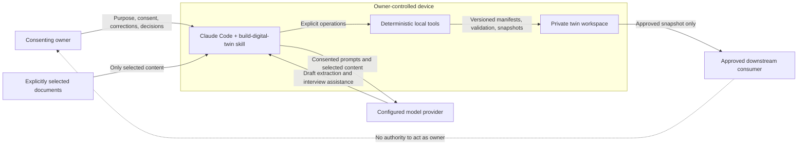
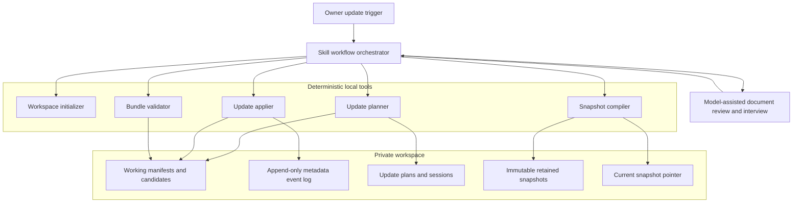
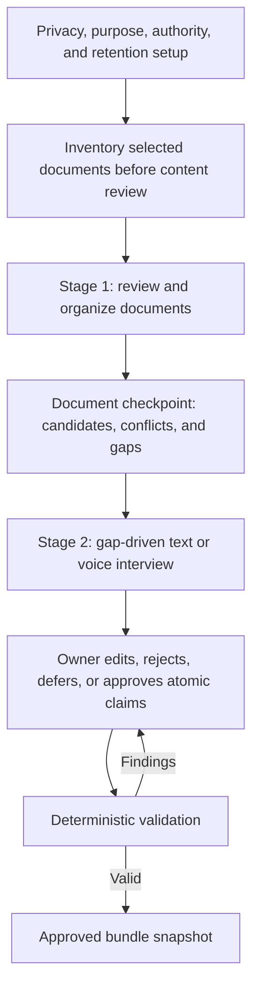
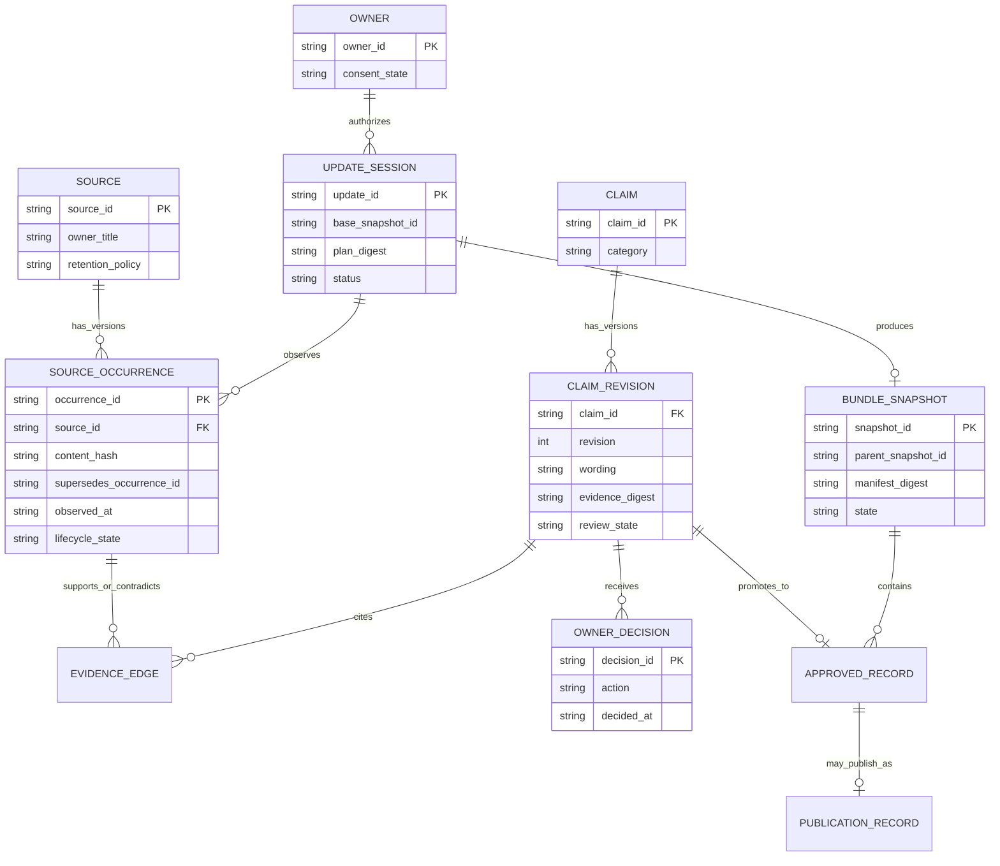
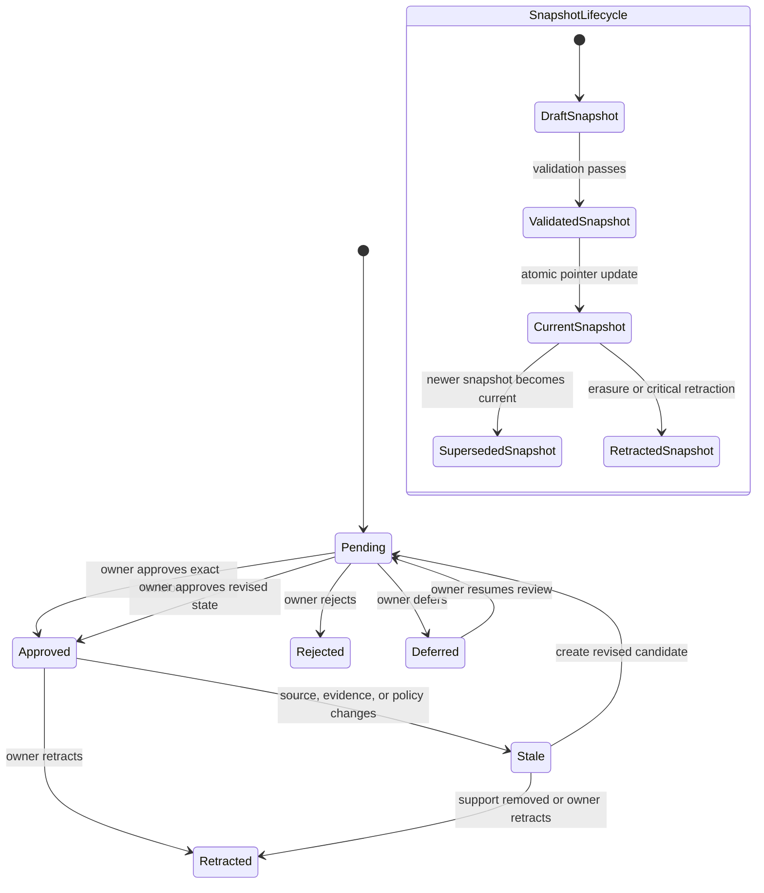
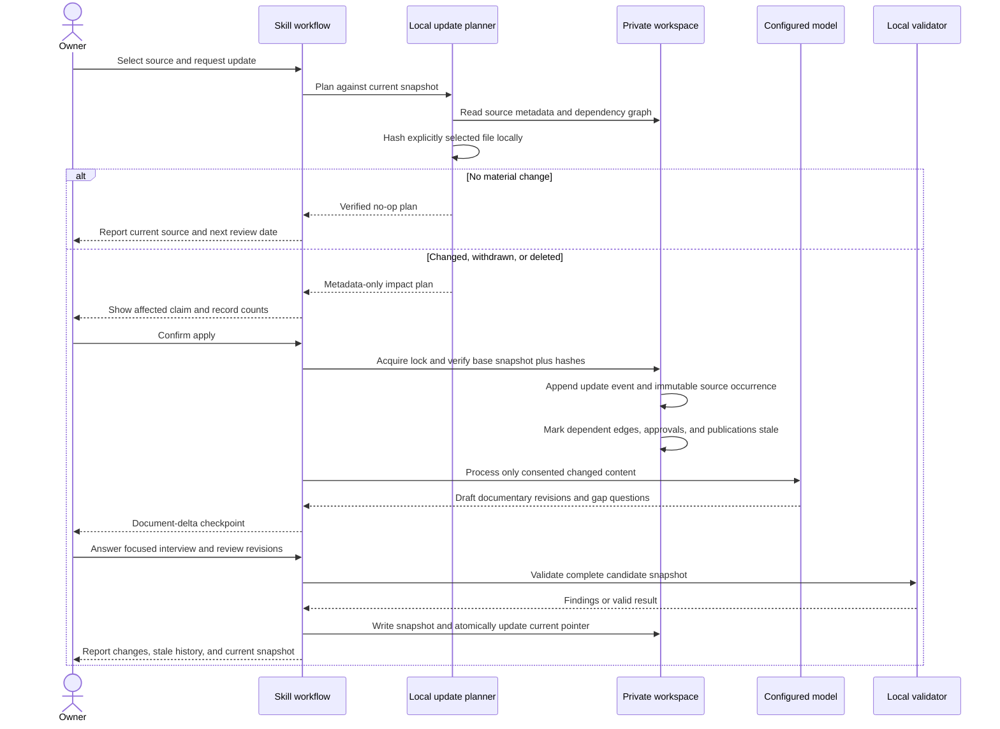

# Digital Twin Builder: design and architecture

| Field | Value |
|---|---|
| Status | Proposed |
| Date | 2026-08-09 |
| Decision owner | Product owner |
| Audience | Product owner, maintainers, reviewers, and future implementers |

## Executive summary

Digital Twin Builder should produce an owner-controlled, evidence-backed representation of a
person's professional context. It is not an avatar, a voice clone, an autonomous representative, or
a simulation of the whole person.

The initial build has two content stages:

1. Review and organize explicitly selected documents into source-linked candidate claims,
   conflicts, and coverage gaps.
2. Conduct a text or voice-captured interview that addresses those gaps without treating the
   owner's answers as independent documentary corroboration.

The proposed update mechanism repeats those stages over changes. It observes only sources the owner
selects, creates immutable source versions, invalidates dependent approvals conservatively, asks
only update-specific interview questions, and makes a new bundle snapshot current only after owner
review and deterministic validation.

This is best described as a **discrete-event synchronized professional context twin**. It converges
with the owner at an explicit cadence rather than watching the owner continuously.

## Contents

- [Does this make sense as a digital twin?](#does-this-make-sense-as-a-digital-twin)
- [Goals, constraints, and invariants](#goals)
- [System context and trust boundaries](#system-context-and-trust-boundaries)
- [Architecture decision and components](#architecture-decision)
- [Initial build lifecycle](#initial-build-lifecycle)
- [Proposed data model](#proposed-data-model)
- [Update lifecycle](#update-lifecycle)
- [Plan/apply update transaction](#planapply-update-transaction)
- [Dependency, privacy, and failure behavior](#dependency-propagation)
- [Current versus proposed capability](#current-versus-proposed-capability)
- [Standards alignment](#standards-alignment)
- [Implementation sequence and acceptance](#implementation-sequence)
- [Open decisions](#open-decisions)
- [Example update](#example-update)

## Does this make sense as a digital twin?

It does if “twin” means a governed digital representation with a stable subject, traceable state,
an update lifecycle, and controlled convergence with its subject.

| Twin characteristic | Digital Twin Builder interpretation |
|---|---|
| Represented entity | One consenting professional owner |
| Digital state | Approved professional claims, context, voice guidance, and boundaries |
| Observation | Owner-selected document versions and owner statements |
| Convergence | Event-driven or periodic owner-controlled update sessions |
| Digital thread | Source revisions, claim revisions, decisions, invalidations, and snapshots |
| Outputs | Private context bundle and separately approved publication records |
| Control | The owner approves accuracy, wording, evidence class, visibility, and rights |

It would not qualify as a high-frequency physical or industrial twin. It has no sensors, simulation,
or real-time bidirectional control. “Professional context twin” is therefore more precise than an
unqualified claim that it models the whole person.

## Goals

- Build useful context from ordinary professional documents.
- Use an interview to fill known gaps rather than produce an ungrounded autobiography.
- Keep every factual statement atomic, source-linked, revisable, and owner-reviewed.
- Keep private evidence separate from approved records and public selections.
- Detect changes and propagate their effects through claims, approvals, publications, and tests.
- Preserve enough history to explain why the current twin says something.
- Support correction, consent withdrawal, source deletion, retraction, and full erasure.
- Produce deterministic, metadata-only validation and update reports.

## Non-goals

- Background monitoring of a home directory, mailbox, calendar, drive, contacts, or messages.
- OAuth connectors, session-cookie capture, or credential replay.
- Real-time synchronization or continuous surveillance.
- Treating the model's semantic comparison as an approval decision.
- Voice recording, voice imitation, or audio storage.
- Automatic publication or autonomous action on the owner's behalf.
- An event-sourced system whose entire private state must be reconstructed from an eternal log.

## Assumptions and constraints

- Version one has one owner and one local workspace per twin.
- Update volume is human-scale: tens of sources and hundreds or low thousands of claims, not a
  high-throughput event platform.
- Deterministic helpers remain standard-library Python 3.9+ and operate on a local filesystem.
- Filesystem atomic replacement and a single-writer lock are sufficient; there is no distributed
  consensus or always-on service.
- Raw documents normally remain at owner-managed external paths.
- Model output is nondeterministic and can draft candidates, but it cannot independently approve or
  authorize committed state.
- Downstream consumers read a compiled snapshot rather than the mutable working graph.
- Provider-side retention and deletion remain governed by the configured provider, not this plugin.

## Core invariants

1. The represented person must consent.
2. Private content is processed only after provider-processing disclosure and scoped consent.
3. A logical source has immutable observed versions; changed bytes never overwrite prior metadata.
4. Documents and owner statements have distinct evidence roles.
5. Every generated or extracted claim begins pending.
6. Approval binds exact claim and evidence state through a digest.
7. A changed, withdrawn, deleted, or retracted dependency invalidates affected approval.
8. Stale or conflicted records are never current public output.
9. Historical snapshots are immutable while retained, but privacy deletion can remove their bytes.
10. The current-snapshot pointer changes only after complete validation.
11. Reports contain opaque identifiers and safe field paths, never matched secrets or source text.
12. The twin represents the owner but cannot impersonate or make commitments for the owner.

## System context and trust boundaries



The model provider is outside the private workspace trust boundary. Source content can cross that
boundary only after disclosure and consent. Deterministic tools should hash files and manipulate
structured metadata locally; their reports must not include source content.

## Architecture decision

Adopt an **owner-controlled, event-based delta synchronization loop**.

Do not implement automatic continuous connectors. A reminder may prompt the owner to begin an
update, but it must not grant source access. “Appropriate synchronization” for this product means:

- immediately after material career events when the owner chooses;
- after a correction, retraction, or deletion request;
- after an explicitly selected source changes; or
- at a chosen review cadence, such as quarterly.

### Options considered

| Option | Freshness | Privacy risk | Complexity | Auditability | Decision |
|---|---:|---:|---:|---:|---|
| Static one-time bundle | Low | Low | Low | Medium | Reject: it becomes stale and is not meaningfully twin-like. |
| Continuous account connectors | High | Very high | Very high | Medium | Reject for this version: scope and third-party exposure are unacceptable. |
| Owner-controlled delta updates | Medium–high | Low–medium | Medium | High | Adopt: freshness is explicit and every mutation is reviewable. |

### Consequences and trade-offs

The decision makes provenance, correction, deletion, and rollback understandable. It also keeps the
owner in control of when private content crosses the provider boundary. The twin can state when it
was last synchronized and explain which evidence supports its current claims.

The cost is deliberate friction. Source changes can invalidate claims that are still factually true,
the owner must reapprove affected records, snapshots consume storage, and schema migration becomes a
real product responsibility. This design favors defensibility over invisible freshness.

If update frequency or collaboration grows beyond one local writer, revisit the filesystem lock,
snapshot storage, and JSON materialized views. Do not introduce distributed infrastructure before
the owner-controlled workflow proves useful.

## High-level component architecture



The event log is an audit trail, not the only source of truth. Current manifests remain the mutable
working view; approved snapshots are immutable while retained. This avoids the operational and
privacy burden of retaining enough event content to reconstruct all private state forever.

## Initial build lifecycle



If the owner has no documents, stage one records an empty documentary baseline and a coverage map.
The interview can then fill gaps, but every factual answer remains self-reported until separately
corroborated.

## Proposed data model



The existing schema already represents source occurrences, evidence edges, claim revisions, owner
decisions, approved records, and publication records. Stable logical sources, update sessions, and
bundle snapshots are proposed additions.

## Update lifecycle

Every maintenance cycle is the two-stage initial workflow applied to a delta:

> document delta → changed candidates and gaps → delta interview → owner review → new snapshot

### Update triggers

- A new résumé, portfolio, project narrative, article, or talk.
- A promotion, new role, completed project, or corrected metric.
- A source changed at a path the owner explicitly reselected.
- An owner correction, consent withdrawal, retraction, or deletion request.
- A manual “is my twin current?” review.
- An owner-approved periodic reminder.

### Source versioning

Keep `source_id` stable for the logical source. Create a new `source_occurrence_id` whenever the
observed bytes or material metadata change. The occurrence records:

- content hash;
- observation time;
- predecessor occurrence;
- processing consent and purpose;
- confidentiality, rights, retention, and third-party status;
- lifecycle state; and
- derivation roots and independence review.

Never overwrite the prior occurrence or count two versions of the same source as independent
corroboration.

### Claim and snapshot states



An old snapshot can remain available for private audit while retained, but it must not remain the
current answer source after an affected record becomes stale. Historical snapshots containing data
covered by a deletion request must be purged or cryptographically erased according to owner policy;
“immutable” must never be used to defeat privacy deletion.

## Plan/apply update transaction

Separate change analysis from mutation.

```text
python3 scripts/update_bundle.py plan WORKSPACE --source-id SOURCE_ID --file EXPLICIT_PATH
python3 scripts/update_bundle.py apply WORKSPACE --plan UPDATE_ID
python3 scripts/update_bundle.py status WORKSPACE
```

The exact CLI is proposed. `plan` is read-only; `apply` changes structured workspace state but does
not approve claims or publish records.



### Plan contents

An update plan should contain metadata only:

```json
{
  "update_id": "update-opaque-id",
  "base_snapshot_id": "snapshot-opaque-id",
  "trigger": "owner_selected_source_refresh",
  "source_changes": [],
  "impacted_claim_ids": [],
  "impacted_record_ids": [],
  "planned_actions": [],
  "plan_digest": "sha256:..."
}
```

Do not include excerpts, raw paths in reports, suspected secrets, or interview answers. The private
plan file may retain an owner-selected path if execution requires it, but displayed reports should
use the source ID and safe location metadata.

### Apply guarantees

1. Acquire a single-writer workspace lock.
2. Verify that `base_snapshot_id`, the plan digest, and observed file hashes still match.
3. Refuse a stale plan rather than merge concurrent updates silently.
4. Append a `started` update event before mutation.
5. Write files through temporary siblings and atomic replacement.
6. Mark affected approved/public records stale before model-assisted redrafting.
7. Never change the current pointer until the candidate snapshot validates.
8. Make replay of a completed update ID a deterministic no-op.
9. On failure, leave the previous current snapshot intact and expose a recoverable failed session.
10. Append `completed`, `failed`, or `abandoned` without source content.

## Dependency propagation

The validator and updater traverse this dependency path:

```text
source occurrence
  → evidence edge
  → claim revision
  → owner approval
  → approved record
  → bundle snapshot
  → publication record
  → evaluation cases that rely on the claim
```

For a changed source, create a new occurrence and mark prior dependent evidence stale until the new
version is compared. For withdrawn or deleted evidence, remove it from the evidence ceiling
calculation immediately. Recalculate support, invalidate exact approval digests, retract or hide
ineligible public output, and flag affected evaluation answers for review.

Use conservative invalidation. A formatting-only edit may eventually be judged immaterial, but the
model must not make that judgment binding. Owner reapproval restores eligibility.

## Proposed workspace additions

```text
<workspace>/
  updates/
    events.jsonl
    plans/<update-id>.json
    sessions/<update-id>.json
  snapshots/
    <snapshot-id>/
      snapshot-manifest.json
      approved-records.json
      context/
  state/
    current.json
  locks/
    update.lock
```

- `events.jsonl` contains opaque IDs, event types, digests, and timestamps—not source content.
- `plans/` contains read-only change proposals bound to a base snapshot and digest.
- `sessions/` records transaction status and recovery information.
- `snapshots/` contains immutable retained compiled views.
- `state/current.json` is the atomic pointer to the only current approved snapshot.
- `locks/update.lock` prevents concurrent writers; it contains no secret state.

Raw source bytes should remain at owner-managed external paths unless the owner separately chooses a
retention mode that copies them. A snapshot should contain compiled approved context, not raw source
documents or transcripts.

## Privacy, deletion, and audit tension

Auditability and deletion pull in opposite directions. Resolve that tension as follows:

- Keep detailed content in current working state and retained snapshots only as long as authorized.
- Keep the event log content-free so most audit history can survive source deletion safely.
- On deletion, purge source bytes managed by the workspace, affected transcript content, compiled
  snapshot content, and any cached model inputs under local control.
- Retain only an opaque tombstone when policy permits: what class of item was removed, when, under
  which owner decision, and which dependencies were invalidated.
- Do not promise deletion from the configured model provider; direct the owner to provider controls.
- Support complete profile erasure, including events and tombstones, when the owner chooses it and
  no external retention obligation applies.

## Failure handling

| Failure | Required behavior |
|---|---|
| Source changes after planning | Refuse apply and require a new plan. |
| Concurrent update starts | Second writer fails without mutation. |
| Process crashes during apply | Previous current snapshot remains intact; session is recoverable. |
| Model extraction fails | Structured invalidation remains visible; no draft becomes approved. |
| Owner abandons review | Affected items remain stale; unaffected current records remain usable. |
| Validation fails | Do not create or activate a current snapshot. |
| Current pointer write fails | Retain the prior pointer and mark the new snapshot unattached. |
| Deletion affects old snapshots | Remove affected retained content and preserve only permitted tombstones. |
| Possible secret detected | Stop, report category and safe field path, and never echo the match. |

## Security and privacy controls

- Restrictive workspace permissions where supported.
- Explicit owner-selected paths; no broad enumeration.
- Local hashing before provider content processing.
- Scoped model-processing consent for each new source category or purpose.
- Imported content treated as untrusted data, never executable instructions.
- Opaque IDs in audit and diagnostic output.
- Approval and plan digests over canonical structured state.
- Separation of private provenance, approved records, and public records.
- Default-deny publication after any relevant invalidation.
- Owner-configurable retention for sources, transcripts, events, plans, and snapshots.

## Current versus proposed capability

| Capability | Current plugin | Proposed update architecture |
|---|---|---|
| Private workspace initialization | Implemented | Reuse |
| Source occurrence and content hash | Implemented | Add stable logical-source version chain |
| Atomic claims and evidence edges | Implemented | Reuse for delta candidates |
| Evidence-strength ceiling | Implemented | Recalculate during apply and validation |
| Exact owner approval digest | Implemented | Invalidate on update |
| Append-only owner decisions | Implemented | Add update decisions and snapshot linkage |
| Deletion/stale propagation | Implemented in validation model | Invoke transactionally during apply |
| Publication gates | Implemented | Apply to the current snapshot |
| Update event log | Not implemented | Add metadata-only append log |
| Plan/apply transaction | Not implemented | Add deterministic update tool |
| Workspace concurrency control | Not implemented | Add lock and optimistic base revision |
| Immutable bundle snapshots | Not implemented | Add retained snapshot compiler |
| Atomic current pointer | Not implemented | Add after successful validation |
| Reminder cadence | Not implemented | Optional later; reminders grant no access |

## Standards alignment

This design borrows concepts from standards but does not claim certification or conformance:

- [ISO/IEC 30173:2023](https://www.iso.org/standard/81442.html) supplies general digital-twin
  terminology, lifecycle, functional-view, and stakeholder concepts.
- [ISO 23247-5:2026](https://www.iso.org/standard/87425.html) describes a digital thread that creates,
  connects, manages, and maintains manufacturing twins across a lifecycle. This design applies the
  digital-thread principle by analogy; the standard's domain is manufacturing.
- [W3C PROV-DM](https://www.w3.org/TR/prov-dm/) supplies generation, derivation, revision,
  invalidation, and attribution concepts for the provenance graph.
- [NIST AI RMF Core](https://airc.nist.gov/airmf-resources/airmf/5-sec-core/) recommends continuous
  lifecycle risk management, monitoring, user input and override, decommissioning, recovery, and
  change management.
- [ISO/IEC 27701:2025](https://www.iso.org/standard/27701) supplies privacy information management
  requirements and guidance for personally identifiable information controllers and processors.

## Implementation sequence

### Phase 1: schema foundation

1. Add stable logical-source records and predecessor links between source occurrences.
2. Add update-plan, update-session, update-event, and snapshot-manifest schemas.
3. Add snapshot IDs to owner decisions and approved records where needed.
4. Define retention and erasure behavior for plans, events, and snapshots.

These schema changes should increment the bundle schema and policy versions. Migration must be
explicit; do not silently reinterpret an existing `0.1.0` bundle.

### Phase 2: deterministic update transaction

1. Implement `update_bundle.py plan`, `apply`, and `status` with standard-library Python.
2. Add locking, optimistic base revision, plan digests, atomic writes, and idempotency.
3. Extend validation for version chains, event ordering, snapshots, and the current pointer.
4. Add synthetic crash, concurrency, stale-plan, deletion, and replay tests.

### Phase 3: skill workflow integration

1. Add update onboarding and scoped consent instructions.
2. Produce a document-delta checkpoint from the plan.
3. Generate only interview questions tied to affected conflicts or gaps.
4. Route revised claims through existing owner review.
5. Compile and activate the new snapshot only after validation.

### Phase 4: optional cadence support

Add owner-approved reminders for update reviews. Do not add automatic source access or connectors as
part of cadence support.

## Acceptance criteria

- Rechecking an unchanged source produces a deterministic no-op.
- Changed bytes create a new occurrence linked to the prior occurrence.
- Duplicate or derived versions never increase independent evidence strength.
- A stale plan cannot mutate a newer workspace revision.
- Apply invalidates every dependent approval, approved record, publication, and evaluation answer.
- The update interview asks from the delta coverage map rather than restarting onboarding.
- No claim becomes approved without a current owner decision bound to exact state.
- No stale record appears through the current snapshot.
- A crash cannot replace the current pointer with a partial snapshot.
- Deletion propagates into retained snapshots and locally controlled caches.
- Reports never contain source text, raw secret matches, or unsafe dynamic field names.
- The complete initial and update workflows remain usable through typed conversation.

## Recommended product defaults

- **Synchronization mode:** owner-triggered plus optional quarterly reminder.
- **Changed-source policy:** conservatively stale dependent approvals immediately on apply.
- **Publication policy:** hide affected current public records until reapproved.
- **Snapshot retention:** owner-configurable; default to current plus one prior private snapshot.
- **Raw source storage:** external owner-managed paths by default.
- **Interview mode:** typed by default; voice capture optional and text-equivalent.
- **Concurrency:** one writer per workspace.
- **Identity scope:** one consenting owner per workspace in the first implementation.

## Open decisions

1. Should a periodic reminder default to quarterly, remain unset, or be selected during onboarding?
2. Should private consumers see stale records with labels, or should stale records disappear entirely?
3. How many historical snapshots should be retained by default?
4. What owner identity verification is required before high-risk approval or erasure actions?
5. Should snapshots use the current JSON bundle format only, or add an optional W3C PROV export?
6. Is “professional context twin” the primary product name, with “digital twin” as a discoverability
   term?

These decisions do not block the architecture. They should be resolved before implementing the
update schemas because they affect retention, access, and migration behavior.

## Example update

An owner replaces a résumé after a promotion:

1. The owner explicitly selects the new résumé and requests an update.
2. The planner hashes it locally and detects a change from the previous occurrence.
3. The plan reports that employment, timeline, accomplishment, and publication records may be
   affected; it does not display résumé text.
4. The owner confirms apply. A new source occurrence is appended and dependent approvals become
   stale.
5. Document review drafts a new role claim, finds an ambiguous start date, and notes that the résumé
   does not explain the owner's decisions or results.
6. The interview asks only about the date, responsibility, decisions, and qualified outcomes.
7. The owner corrects and approves exact revised claims.
8. Validation succeeds, a new snapshot is compiled, and the current pointer changes atomically.
9. The prior snapshot remains private history only while retention permits; affected public records
   are replaced only by separately approved publication records.

That cycle provides useful convergence without silently watching the owner or granting the twin
authority to act.
